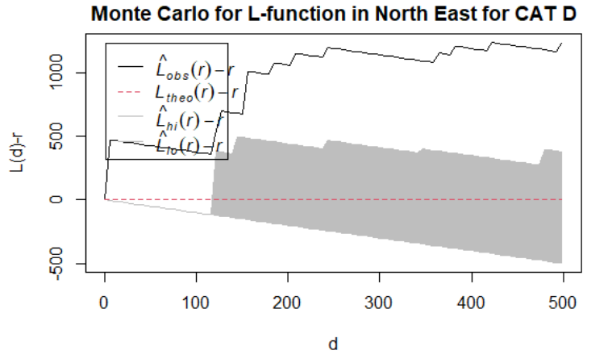
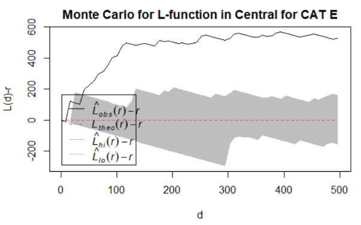
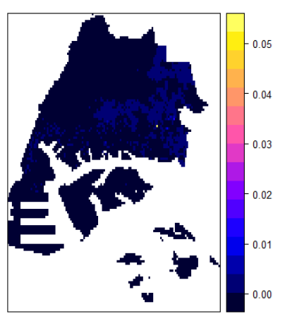

# Introduction 
As Singapore accelerated efforts to digitally transform itself, various government agencies such as the Urban Redevelopment Authority (URA) and the Land Transport Authority (LTA) has released data on public on-line data portals such as data.gov.sg and OneMap. The datasets obtained can be used to track spatial point patterns and identify potential clusters for businesses registered in Singapore. For example, corporate entity data as well as their respective SSIC classification were collected. These data contain information and patterns which can be analysed to provide greater insights on the spatial distribution of businesses and clusters of business categories in Singapore on a subzone level. The insights can possibly lead to improvements in industry policy making and provide useful information for private companies or Government-Linked Companies to make better business decisions.

In practice, the use and analysis of a spatial data tends to be limited to Geographic Information Systems (GIS). However, access to GIS applications tend to be limited. Furthermore, the use of GIS applications is specialised and might not be suited as a decision-making or policy planning tool.

To address these two issues, we designed and developed LandMarkdown - an analytics dashboard which aims to provide government policy makers and business decision makers with a tool to analyse corporate entity data from a spatial analytics point of view.

This paper showcases our research and development work into designing and implementing a dashboard to assist business decision makers and government policy makers in analysing and visualising the spatial distribution of businesses and clusters of business categories in Singapore on a subzone level. Section 1 provides a general introduction of the paper, followed by an overview of the motivation and objectives of our research in Section 2. Section 3 provides a review of the literature detailing relevant work in our research area. We provide a detailed overview of the methodology and the results behind our research efforts in Sections 4 and 5 respectively. In the next section, we discuss the insights enabled from our research efforts, before ending off by concluding how the research can be extended in the future.

# Motivation and Objectives
Our research and development efforts were motivated by the idea of simplifying analytical tools for the discovery of spatial point patterns and clusters in corporate entity data. Our solution aims to provide government policymakers and business decision makers with an analytical dashboard to visualise the spatial distribution of corporate entities of different industry categories. Our specific objectives are:

1. To visualise the spatial distribution of corporate entities in Singapore by industry categories on an internet-based map such as OpenStreetMap.
1. To conduct statistical simulations to reveal evidence of clustering using spatial point patterns analysis.
1. To reveal characteristics of spatially constrained clusters through clustering techniques.
1. To provide a user-friendly interface which supports the use of a variety of filters and options as dynamic inputs for visualisations.
1. To display the data on-demand in a tabular format.

# Related Work
Work has been done on the spatial point patterns and industry concentration analysis in Germany. For example, clusters can positively affect competition by increasing productivity and innovation as well as stimulating the formation of new businesses, through economic effects such as economies of scale [@kosfeld2011].

However, traditional metrics for industry concentration do not account for geospatial effects. They fail to account for the formation of clusters at different geographic scales, and the degree of concentration is not expected to be independent on the reach of grouping of the firms [@kosfeld2011]. Kosfeld et al. introduced a concentration index of the style of Besag’s L function [@besag1977] that is based on the concept of the K function. While Besag’s L function is intended to measure deviations from the CSR process, the new index can be applied to identify the importance of sector-specific and more general industry-specific forces inducing clustering.

In addition, Kosfeld et al. also proposed a feasible testing procedure enabling a usage of the K function approach efficiently for large study regions. For this, Diggle and Chetwynd’s D function approach [@diggle1991] is replaced by a spatial similarity test based on subsamples drawn from the industry under analysis and the reference population.

While concentration of the branches of industry in Germany was only available at spatial scales given by arbitrarily defined regions. While the authors illustrated their K function approach by using selected industries, the authors additionally provided concentration numbers for sixteen German industries within different distance bands.

Based on a report by Economic Modelling LLC, a metric known as the location quotient can be used to measure the concentration of industries in a region compared to the entire nation [@emsi2020], which could be suitable to analyse cluster variables when performing geographic segmentation.

# Methodology

## Data Collection
We have listed the data we collected as well as the source in the following list:

-	[Corporate Entities Information](https://data.gov.sg/dataset/acra-information-on-corporate-entities). This dataset comprises data on entities that are registered in Singapore, with additional information such as paid-up capital.
-	[Singapore Standard Industrial Classification 2020](https://www.singstat.gov.sg/standards/standards-and-classifications/ssic). The Singapore Standard Industrial Classification (SSIC) is the national standard for classifying economic activities undertaken by economic units.
-	[Master Plan 2014 Subzone Boundary (No Sea)](https://data.gov.sg/dataset/master-plan-2014-subzone-boundary-no-sea). To facilitate urban planning, the URA divides Singapore into regions, planning areas and subzones.

The data was directly downloaded in .csv or .shp format from the source, except for geometry data, which was collected by calling the Search API (https://docs.onemap.sg/#search) provided by OneMap. The output of the search API was saved into a .csv file named *geom_data.csv*.
Data tables of the data used can be found under the **Data** tab of the LandMarkdown R Shiny Application.

## Data Wrangling and Transformation

After collection the data required, it is not in the appropriate format for us to conduct our analysis. To fix this, we had to perform some data wrangling and transformation.

Firstly, we removed companies which are registered before 2017 using the *filter()* and *mutate()* functions of the **tidyverse** package. We included companies registered after 2017 to ensure that the registration of corporate entities is not affected by the changes in business environment before that time. This is to better capture the effects of recent government policy and/or economic conditions on the registration of corporate entities.

Secondly, we removed companies which are not `Live` using the *filter()* function of the **tidyverse** package. These companies have been deregistered or suspended operations for various reasons. As we are currently interested in business which are still in operations, only `Live` companies are retained.

Thirdly, a metric for measuring industrial concentration was required. As such, we have used ***location quotient*** used by Economic Modeling LLC [@emsi2020] as our metric, and the formula for calculating the location quotient of industry *a* in subzone *i* is shown as follows:

$LQ_{a,i} =\frac{\frac{i_{a}}{\sum_{i = 0}^{n}i_{a}}}{\frac{i_{Singapore}}{\sum_{i = 0}^{n}i_{Singapore}}}$

where:

- $LQ_{a,i}$ refers to the Location Quotient for industry *a* in subzone *i*,
- $i_{a}$ refers to the number of industry *a* in subzone *i*,
- $\sum_{i = 0}^{n}i_{a}$ refers to the sum of all industries in subzone *i*,
- $i_{Singapore}$ refers to the number of industry *a* in Singapore,
- and $\sum_{i = 0}^{n}i_{Singapore}$ refers to the sum of all industries in Singapore.

The data, which was initially separate, was then combined using a series of *left_join()* functions, by using common elements such as the SSIC Code as well as the postal code.

## Data Exploration
To further understand the data, we conducted our exploratory data analysis (EDA). Our EDA seeks to understand the distribution of the data by plotting the appropriate boxmaps or histograms using the number of corporate entities by industry category (in terms of absolute value or location quotient).

We have also visualised the correlation matrix using the corrplot() function. For our research, a correlation of with a magnitude greater than 0.8 is considered to be highly correlated. Appropriate cluster variables should be removed to reduce the impact of multicollinearity on our subsequent analysis. 

## Spatial Point Patterns Analysis
Before conducting our analysis, we noticed that there are areas with totally no businesses in sight at a glance. Therefore, it was more appropriate for us to identify these areas and exclude them out of our analysis as they serve no purpose and does not value add to our process.

However, before proceeding with the filtering of area, in spatial point patterns analysis an issue of significant is the presence of duplicates. The statistical methodology used for the processes is largely based on the assumption that processes are simple, and points cannot be coincident. Therefore, to check for duplicates, we used the combination of any() and duplicated() function to identify the number of duplicated point events. In the case of duplicates, we will use jittering which will add a small perturbation to the duplicated points, so they do not occupy the same space.

Subsequently, we then proceeded to analyse the spatial point process with the L-function and Monte Carlo simulations to perform the spatial randomness test to see if the distribution of businesses are randomly distributed or not.

We will also perform Kernel Density Estimation to calculate the intensity of a point distribution to identify and spot signs of clustering, the gaussian kernel was chosen to avoid underfitting and overfitting of the kernel density estimation. This will be displayed in an interactive map fashion.

## Clustering
There are two primary methods of performing clustering: a hierarchical clustering or a spatially constrained clustering approach. 

### Hierarchical Clustering
For hierarchical clustering, we used the agnes() function to determine the most appropriate clustering algorithm. We will use only one algorithm for our analysis. However, in our LandMarkdown application, users have the option to change the clustering algorithm to observe the differences, if any. In addition, we have calculated the Gap statistic to determine the optimal number of clusters.

We have also plotted a dendrogram where members of each clusters are separated by boxes with different border colours. There is also a heatmap where we can observe the profile of each cluster by looking at the features of each cluster member.

### Spatially-constrained Clustering
We note that using hierarchical clustering may sometimes be suboptimal as it does not consider spatial constraints. As such, we have decided to implement the ***Spatial Kluster Analysis by Tree Edge Removal*** (SKATER) approach to identify it the geographic segmentation would be affected once spatial constraints are introduced.

This will be done via the following steps:
1. Converting the existing data into *SpatialPolygonsDataFrame* format.
1. Computing the neighbours list.
1. Calculate edge costs and compute the minimum spanning tree.
1. Using the *skater()* function to create a *skater* object and visualising the results.

# Results

## Data Exploration

```{r corrplot, echo=FALSE, out.width="100%", fig.cap="Correlation of  cluster variables"}

```

Based on **Figure 1**, there were no cluster variables which are highly correlated to each other. Therefore, none of them were discarded during the clustering analysis.

## Spatial Point Patterns Analysis 

As mentioned previously, there were certain areas that have no businesses located in the subzone. We have identified these areas and removed them. They include "NORTH-EASTERN ISLANDS", "CENTRAL WATER CATCHMENT", "CHANGI BAY", "MARINA SOUTH", "SIMPANG", "SOUTHERN ISLANDS", "STRAITS VIEW" and "TENGAH”. 

For the spatial randomness test, we used the L-function and Monte Carlo simulations on the 5 different regions: Northeast, North, Central, West and East for 4 industries: “AGRICULTURE AND FISHING” (CAT A), “MINING AND QUARRYING” (CAT B), “ELECTRICITY, GAS, STEAM AND AIR-CONDITIONING SUPPLY” (CAT D) and “WATER SUPPLY; SEWERAGE, WASTE MANAGEMENT AND REMEDIATION ACTIVITIES” (CAT E). Due to computational limitations, we are only able to select these 4 industries for analysis.  

The hypothesis and test are as follows: 

Ho = The distribution of businesses in the category selected in the region are randomly distributed. 

H1 = The distribution of businesses in the category selected in the region are not randomly distributed. 

The null hypothesis will be rejected if p-value is smaller than alpha value of 0.05. 

Because the alpha value of our hypothesis test is 0.05, we run 2/0.05 = 39 simulations for our Monte Carlo simulations. The following are the results: 

### North-East Region

```{r lfunc_ne, echo=FALSE, out.width="100%", fig.cap="L-function by Industry Category in North-East region", fig.show='hold'}




```

As seen in Figure 2, for Category A, D & E, since the observed L value is greater than L(theo) value for 500m and above the upper confidence envelop, spatial clustering for 500m is statistically significant.

For Category B, since the observed L value is greater than L(theo) value and lower than the upper confidence envelop, spatial clustering for 500m is statistically not significant.

### North Region

```{r lfunc_n, echo=FALSE, out.width="100%", fig.cap="L-function by Industry Category in North region", fig.show='hold'}
knitr::include_graphics("img/lfunc_n_a.png")


```

In Figure 3, for Category A & E, since the observed L value is greater than L(theo) value for 500m and above the upper confidence envelop, spatial clustering for 500m is statistically significant.

For Category B, since the observed L value is smaller than L(theo) value for 500m and beyond the lower confidence envelop, spatial dispersion for 500m is statistically significant.

For Category D, we are unable to determine for the distance within 500m as the envelop is missing.

### Central Region

```{r lfunc_c, echo=FALSE, out.width="100%", fig.cap="L-function by Industry Category in Central region", fig.show='hold'}



```

In the Central Region, as shown in Figure 4, for Category A, B, D & E, since the observed L value is greater than L(theo) value for 500m and above the upper confidence envelop, spatial clustering for 500m is statistically significant.

### East Region

```{r lfunc_e, echo=FALSE, out.width="100%", fig.cap="L-function by Industry Category in East region", fig.show='hold'}


```

For the East Region, as seen in Figure 5, Category A, B & E, since the observed L value is greater than L(theo) value for 500m and above the upper confidence envelop, spatial clustering for 500m is statistically significant.
For Category D, since the observed L value is smaller than L(theo) value for 500m and below the lower confidence envelop, spatial clustering for that distance is statistically not significant.

### West Region

```{r lfunc_w, echo=FALSE, out.width="100%", fig.cap="L-function by Industry Category in West region", fig.show='hold'}


```

In the West Region, Figure 6 shows that for Category A, B, D & E, since the observed L value is greater than L(theo) value for 500m and above the upper confidence envelop, spatial clustering for 500m is statistically significant.

### Kernel Density Estimation

```{r kde_region, echo=FALSE, out.width="70%", fig.cap="Kernel Density Estimation by region", fig.show='hold'}



```

A gaussian kernel was chosen to avoid underfitting or overfitting the kernel density estimation. Based on the KDE maps plotted, the interactive map shows no significant signs of clustering except for certain areas near the central and east region. However, for the static map, we are able to see the distributions more clearly that there are businesses clustered around certain areas of Singapore.

Figure 7 shows both the plots of the static and interactive overlay for the resulting kernel density estimation.

```{r kde_singapore, echo=FALSE, out.width="100%", fig.cap="Kernel Density Estimation (Singapore)", fig.show='hold'}


```

## Clustering

```{r echo=FALSE}
matrix1 <- matrix(c(0.9506336, 0.9528419, 0.9625796, 0.9765662),nrow=1,ncol=4,byrow=TRUE)
knitr::kable(matrix1,
             col.names = c("average", "single", "complete", "ward"),
             row.names = FALSE,
             format = "latex",
             caption = 'Determining Clustering Algorithm using agnes()')
```

In section 4.5, we mentioned that we have used the agnes() function to determine the most appropriate clustering algorithm. Based on Table 1, we can see that Ward’s method provides the strongest clustering structure among the four methods assessed. Hence, in the subsequent analysis, only Ward’s method will be used. Our LandMarkdown application will feature clustering algorithms with a variety of methods.

```{r gap_statistic, echo=FALSE, out.width="100%", fig.cap="Gap statistic visualisation"}

```

Based on Figure 9, while having more clusters will lead to a higher Gap statistic, it is impractical to have too many clusters. As such, after looking at Singapore’s industrial policy [@straitstimes2018], we have determined that it was appropriate to segment into 10 clusters instead. The number of clusters can be changed within our LandMarkdown application.

Figure 10 shows the resulting plot after conducting hierarchical clustering.

```{r hierarchical, echo=FALSE, out.width="100%", fig.cap="Geographic segmentation based on hierarchical clustering"}

```

For our SKATER approach, we realised that there were 2 subzones “SUDONG” and “SEMAKAU”, which are islands with no neighbours. These polygons were removed before the computation neighbours list.

Figure 11 shows the resulting plot after conducting SKATER.

```{r skater, echo=FALSE, out.width="100%", fig.cap="Geographic segmentation based on SKATER"}

```

# Discussion
We have mentioned in section 5.2 that we have determined that segmenting the subzones into 10 clusters was appropriate for our analysis. Based on Singapore’s industrial policy since 2018, the Singapore Government has classified 23 industries and has grouped them into 6 clusters. However, we felt that having 23 clusters is too much as coming up with plans for each cluster is inefficient from our user’s point of view. In addition, with the occurrence of COVID-19, Singapore’s economy was affected, and industries belonging to each of the 6 clusters may have different intra-cluster performance.

There should be a more targeted approach to ensure that industries which are highly affected by COVID-19 and can still contribute to Singapore’s economy are better identified. As such, the team has chosen to segment the subzones into 10 clusters. Since the Gap statistic visualisation does not return a clear optimal number of clusters, our choice of the number of clusters can considered as subjective in nature.

Based on Figure 10 and Figure 11, it appears that the SKATER approach has segmented the subzones into neater clusters. However, this does not necessarily mean that SKATER is better than hierarchical clustering. Since Singapore highly encourages mixed-use development to distribute traffic, jobs, and residential areas [@cnn2019], using the SKATER approach may be less optimal compared to hierarchical clustering as industrial policies should ideally span across different subzones that may not necessarily be bordering one another.

As such, in our opinion, we believe that using hierarchical clustering is more effective for the use case specified. Since hierarchical clustering does not require the computation of a neighbours list, this would mean that should Singapore decide to develop the smaller islands outside of mainland Singapore, that island could be included when re-computing the hierarchical clustering. This is not possible using the SKATER approach, as the computation of the minimum spanning tree would not involve these islands as they do not have any neighbours.

Because of this, our heatmap which showcases the characteristics of each cluster based on the features of every planning area is based on the hierarchical clustering method, as shown in Figure 12.

```{r cluster_profile, echo=FALSE, out.width="100%", fig.cap="Heatmap showing cluster profile"}
knitr::include_graphics("img/cluster_profile.png")
```

# Future Work and Conclusion

Due to computational limitations, we were unable to compute the kernel density estimation using the whole of Singapore. Further work may be needed in order to observe the specific effects when expanding the study area from a region-level to a national level.

In addition, further work may be necessary to incorporate more methods or use different metrics to determine the optimal number of clusters.

In conclusion, we have been able to determine the distribution of industries at a regional level through the use of appropriate statistical testing, and we have also segmented and visualised the makeup of different industry concentrations. We have also developed a R Shiny Application to allow our targeted users to use it as a decision support tool for their needs. We hope that this could further entrench the interest and use of geospatial analytics in Singapore.


# Acknowledgement

The authors wish to thank Dr. Kam Tin Seong, an Associate Professor of Information Systems (Practice) in Singapore Management University for his support and guidance.

# References

---
references:
- id: kosfeld2011
  title: Spatial point pattern analysis and industry concentration
  author:
  - family: Kosfeld
    given: Reinhold
  - family: Eckey
    given: Hans-Friedrich
  - family: Lauridsen
    fiven: Jørgen
  container-title: The Annals of Regional Science
  volume: 47
  URL: 'https://doi.org/10.1007/s00168-010-0385-5'
  DOI: 10.1007/s00168-010-0385-5
  publisher: Springer-Verlag GmbH Germany
  issue: 2
  page: 311-328
  type: article-journal
  issued:
    year: 2011
    month: 10
- id: besag1977
  title: Contribution to the Discussion on Dr. Ripley's Paper
  author:
  - family: Besag
    given: Julian
  container-title: 'Journal of the Royal Statistical Society: Series B (Methodological)'
  volume: 39
  URL: 'https://doi.org/10.1111/j.2517-6161.1977.tb01616.x'
  DOI: 10.1111/j.2517-6161.1977.tb01616.x
  publisher: Royal Statistical Society
  issue: 2
  page: 192-212
  type: article-journal
  issued:
    year: 1977
- id: diggle1991
  title: Second-Order Analysis of Spatial Clustering for Inhomogeneous Populations
  author:
  - family: Diggle
    given: P.J.
  - family: Chetwynd
    given: A.G.
  container-title: Biometrics
  volume: 47
  URL: 'https://doi.org/10.2307/2532668'
  DOI: 10.2307/2532668
  publisher: International Biometric Society
  issue: 3
  page: 1155-1167
  type: article-journal
  issued:
    year: 1991
    month: 9
- id: emsi2020
  title: Understanding Location Quotient
  author:
  - family: Minudri
    given: Isabella
  URL: 'https://www.economicmodeling.com/2020/02/03/understanding-location-quotient-2/'
  issued:
    year: 2020
    month: 2
  type: article
  publisher: Emsi
- id: straitstimes2018
  title: Singapore's 23 key industries to be grouped into 6 clusters as economy begins next phase of transformation
  author:
  - family: Chia
    given: Yan Min
  URL: 'https://www.straitstimes.com/business/economy/singapores-23-key-industries-to-be-grouped-into-6-clusters-as-economy-begins-next'
  issued:
    year: 2018
    month: 4
  type: article
  publisher: The Straits Times
- id: cnn2019
  title: Incentive scheme launched to encourage mixed-use developments in CBD
  author:
  - family: Sim
    given: Fann
  URL: 'https://www.channelnewsasia.com/news/singapore/incentive-scheme-launched-to-encourage-mixed-use-developments-in-11383938'
  issued:
    year: 2019
    month: 3
  type: article
  publisher: ChannelNewsAsia
...

